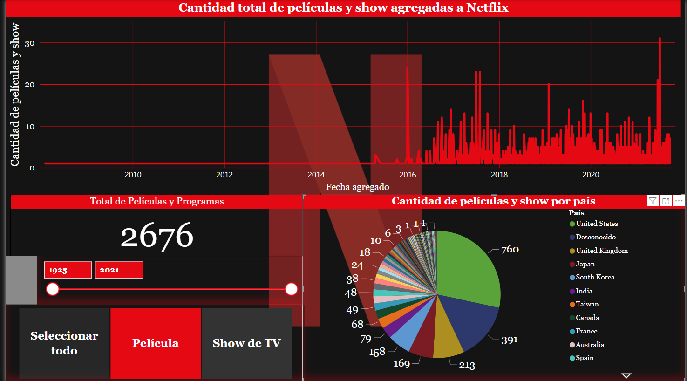
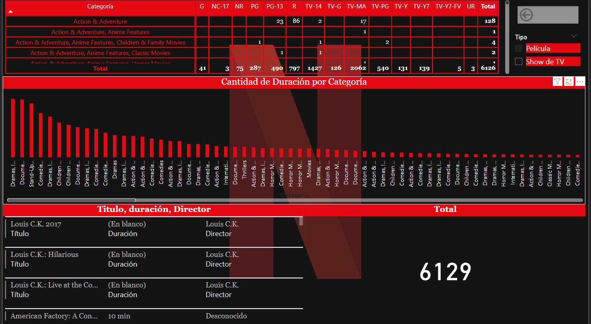

# Informe Netflix
Fuente: kaggle
proyecto: https://app.powerbi.com/reportEmbed?reportId=6a0be59f-9639-4bca-a93e-88d464840846&autoAuth=true&ctid=717b9a79-1b91-41ab-a6f7-a579b46a9b41
## Analisis de cantidad
Analisis de la cantidad de peliculas y show producidas por  pais.

## Analisis de categoria x rating 
Analisis  de de las categirias x rating de las peliculas y show agergadas a netflix
